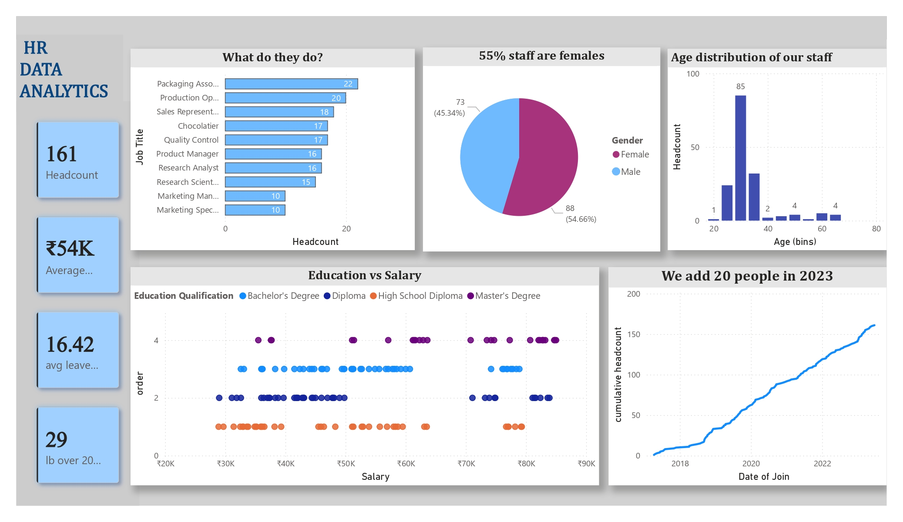

# HR-Analytics-Dasboard

## Project Objective

This HR Analytics Dashboard was developed in Power BI to provide a comprehensive view of workforce composition, compensation trends, employee demographics, hiring patterns, and leave management. The dashboard helps HR teams and business leaders make data-driven workforce decisions.

## Key Business Insights

## KPI
161 Headcount
54K Average Salary
16.42 Average Leave Balance

### Workforce Composition

* The organization maintains a healthy gender distribution with a slight female majority, indicating a balanced workforce environment.
* Most employees fall within the early-to-mid career age range, creating a workforce that combines adaptability, learning potential, and long-term growth opportunities.

### Hiring Trends

* Employee growth has remained steady over the years, with a noticeable increase in hiring activity during the most recent period.
* The rising headcount suggests organizational expansion and increased workforce demand.

### Compensation Analysis

* Salary levels strongly align with educational qualifications, highlighting the organization's emphasis on academic and professional credentials.
* Strategic and research-focused roles receive higher compensation, reflecting their impact on innovation and business outcomes.
* Operational roles show more standardized salary structures, ensuring consistency across similar positions.

### Department and Role Insights

* Production and packaging functions represent the largest share of the workforce, indicating that operational activities are the backbone of the organization.
* Research, product management, and marketing leadership roles contribute significantly to the organization's value creation despite having comparatively smaller teams.

### Leave Management Insights

* Certain operational departments demonstrate higher leave balances, which may indicate opportunities to encourage leave utilization and support employee well-being.
* Monitoring leave patterns can help HR proactively manage workforce availability and prevent employee burnout.

### Workforce Planning Opportunities

* The organization appears to maintain a balanced mix of operational, analytical, and managerial talent.
* Future workforce planning efforts can focus on succession planning for specialized roles while continuing to support growth in core operational functions.

## Tools & Technologies

* Power BI Desktop
* Data Modeling
* DAX Measures
* Interactive Dashboard Design
* HR Analytics & Workforce Reporting

## Dashboard Preview

## Conclusion

The dashboard transforms raw HR data into actionable business insights by highlighting workforce trends, compensation structures, employee demographics, and leave management patterns. It enables HR professionals and decision-makers to identify opportunities for workforce optimization, improve employee experience, and support strategic organizational growth.
